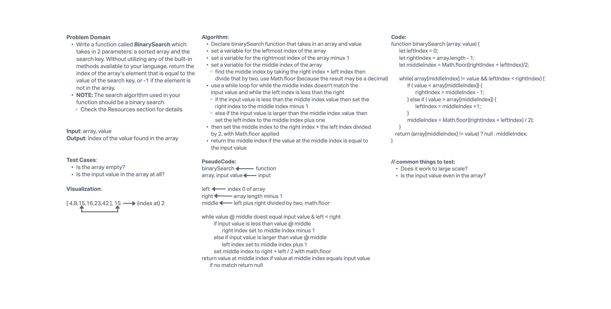

# Array Insert and Shift

- Write a function called BinarySearch which takes in 2 parameters: a sorted array and the search key. Without utilizing any of the built-in methods available to your language, return the index of the array’s element that is equal to the value of the search key, or -1 if the element is not in the array.
  - NOTE: The search algorithm used in your function should be a binary search.
Check the Resources section for details

## Whiteboard Process

## Approach & Efficiency

Today we cruised through this code challenge! It seemed too good to be true! Turned out it was. We missed the note under the feature tasks that says the function requires a BINARY search. Makes sense because of the code challenge title. So it was back to the drawing board. After scrutinizing the Wikipedia page provided in the resources, we figured out what needed to be done. With a binary search (which seems to only work with arrays that are in ascending order), the center of the array is found and compared to the input value. If the center value is less than the input value then the lower half of the array is removed and the upper half is used to compare. A middle is found again, and the same cutting of the array occurs. This continues until a value in the array matches the input value.
