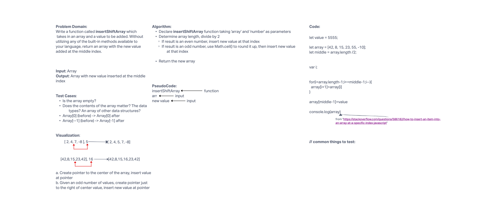

# Array Insert and Shift

Write a function called insertShiftArray which takes in an array and a value to be added. Without utilizing any of the built-in methods available to your language, return an array with the new value added at the middle index.

## Whiteboard Process

## Approach & Efficiency

Today was the first time working with a partner for the code challenge. Tim Traylor and I worked well together, however we had difficulty deciding how to complete this challenge. We started out our whiteboard process as usual, the problem domain, the input and output, the test cases, visualization, and algorithm. We knew what we wanted to happen, but were not sure how to achieve it without using pre-made methods like .slice(). We knew we needed the array.length divided by 2, and if the number doesn't produce a decimal, then the number is even and the new value should be placed at that index of the array and have the other numbers shift down. If the division produced a decimal, then the array has an odd number of values, then the Math.ceil() should be applied to the decimal to find the index at which the new value should be placed. After an hour of trial and error, Tim found a solution online that seemed to work. We used that for our code, made sure to add the source, and called the code challenge good.
