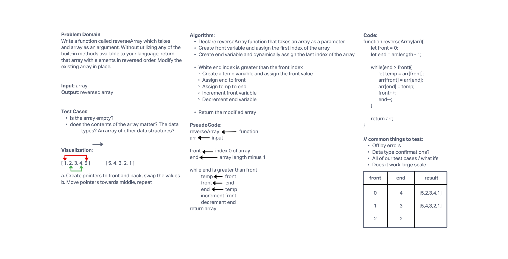

# Reverse an Array

Write a function called reverseArray which takes an array as an argument. Without utilizing any of the built-in methods available to your language, return an array with elements in reversed order.

## Whiteboard Process

## Approach & Efficiency

The approach that I took followed what we discussed in lecture today. With an array that needs to be reversed, the first and last value will swap, then the second and second to last value will swap, and so on. This method would stay dynamic by refering to the last value in the array as arr.length minus 1, therefore the length of the array can change and the function will still work. The Big O time for this would be O(n) with 'n' depending on the length of the array. The Big O space would be O(1) because the same array is changed in place, taking up the same amount of space as it started with.
