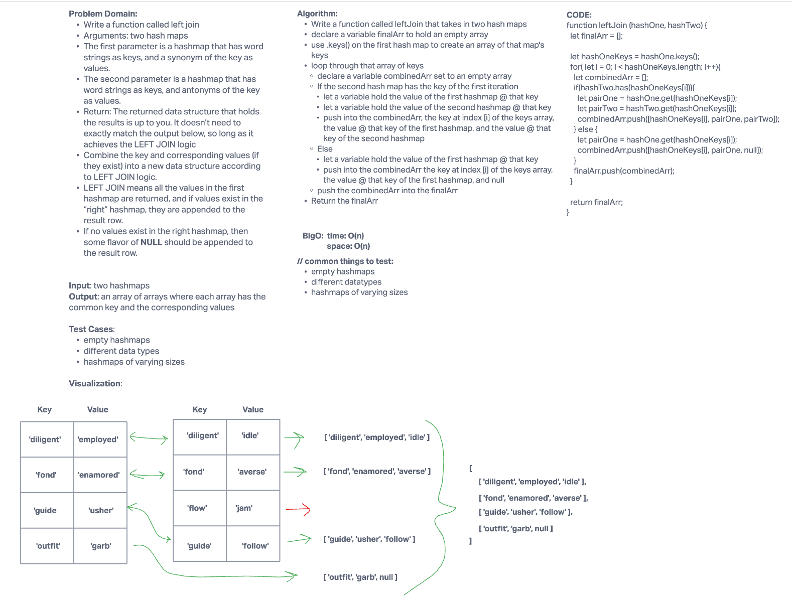

# Hashmap Left Jion

- Authors: KC Hofstetter

## Whiteboard Process

## Approach & Efficiency

- Write a function called leftJoin that takes in two hash maps
- declare a variable finalArr to hold an empty array
- use .keys() on the first hash map to create an array of that map's keys
- loop through that array of keys
  - declare a variable combinedArr set to an empty array
  - If the second hash map has the key of the first iteration
    - let a variable hold the value of the first hashmap @ that key
    - let a variable hold the value of the second hashmap @ that key
    - push into the combinedArr, the key at index [i] of the keys array, the value @ that key of the first hashmap, and the value @ that key of the second hashmap
  - Else
    - let a variable hold the value of the first hashmap @ that key
    - push into the combinedArr the key at index [i] of the keys array, the value @ that key of the first hashmap, and null
  - push the combinedArr into the finalArr
- Return the finalArr

- Big O:
  - Time - O(n)
  - Space - O(n)

## Solution

- You can find some test code at the bottom of the hashmap-left-join.js file! In your terminal, run 'npm test hashmap-left-join.test.js' to test this code.
