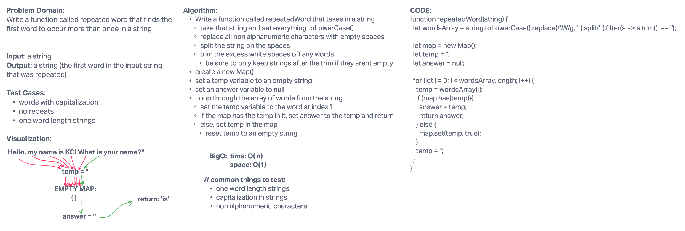

# Repeated Words

## Challenge

- Write a function called repeated word that finds the first word to occur more than once in a string
- Arguments: string
- Return: string

## Whiteboard Process

## Approach & Efficiency

- Write a function called repeatedWord that takes in a string
  - take that string and set everything toLowerCase()
  - replace all non alphanumeric characters with empty spaces
  - split the string on the spaces
  - trim the excess white spaces off any words
    - be sure to only keep strings after the trim if they arent empty
- create a new Map()
- set a temp variable to an empty string
- set an answer variable to null
- Loop through the array of words from the string
  - set the temp variable to the word at index 'i'
  - if the map has the temp in it, set answer to the temp and return
  - else, set temp in the map
    - reset temp to an empty string

- BigO: time: O( n) & space: O(1)

## Solution

- Pass in any string to the repeatedWord function, and it will return a string of the word that was repeated FIRST
