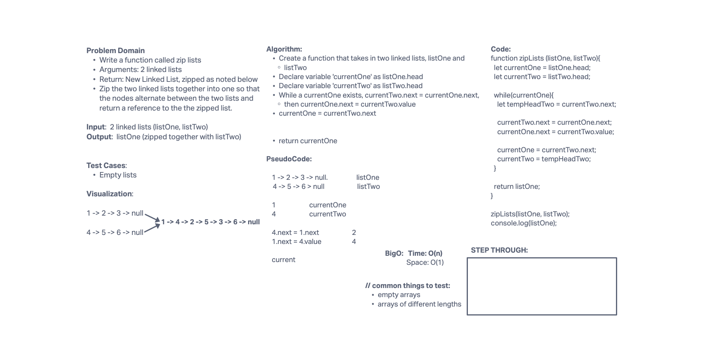

# Linked List Zip

- Write a function called zip lists
- Arguments: 2 linked lists
- Return: New Linked List, zipped as noted below
- Zip the two linked lists together into one so that the nodes alternate between the two lists and return a reference to the the zipped list.
- Try and keep additional space down to O(1)
- You have access to the Node class and all the properties on the Linked List class as well as the methods created in previous challenges.

## Whiteboard Process

## Approach & Efficiency

Given two singly linked lists, we created a function names zipLists that takes in those two lists. Set a variable for currentOne to listOne.head and a variable for currentTwo to listTwo.head - this starts the pointers on each list at the head. While a currentOne exists, set temp variables to hold the nodes that currently exist as currentOne.next and currentTwo.next. Set current.Two.next to currentOne.next (so that the first node in list two points to the second node in list one), the set currentOne.next to currentTwo (so that the first node in list one points to the first node in list two). At this point, the first node in list two is inserted into the second space of list one. Set currentTwo to the temp variable that holds the second node in list two and set currentOne to the temp variable holding reference to the original second node in list one. Now the pointers are pointing at the original 2nd nodes of each list and the process starts again. The result is one list made by combining two lists. Return listOne.

My teammate and I worked together on the whiteboard for the given 1 hour time block, however I messed with the code a little more after that and ended with this as the solution:

        function zipLists (listOne, listTwo){
          let currentOne = listOne.head;
          let currentTwo = listTwo.head;

          while(currentOne){
            nextOne = currentOne.next;
            nextTwo = currentTwo.next;

            currentTwo.next = currentOne.next;
            currentOne.next = currentTwo;

            currentTwo = nextTwo;
            currentOne = nextOne;
          }

          return listOne;
        }
