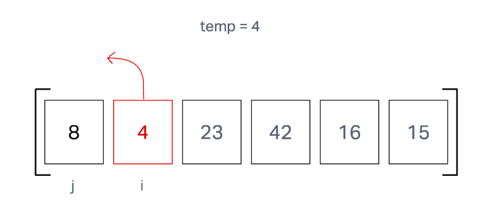
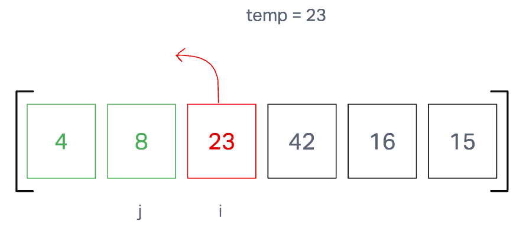
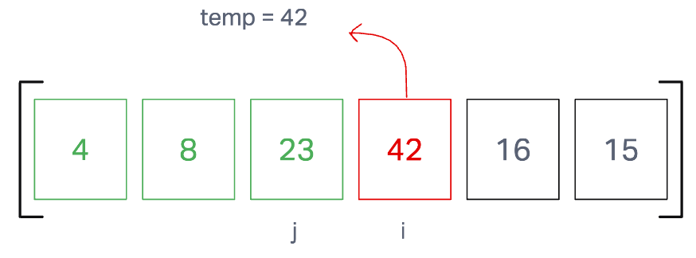
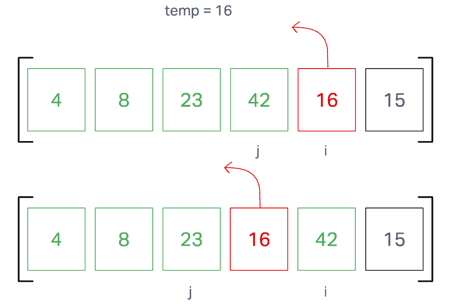
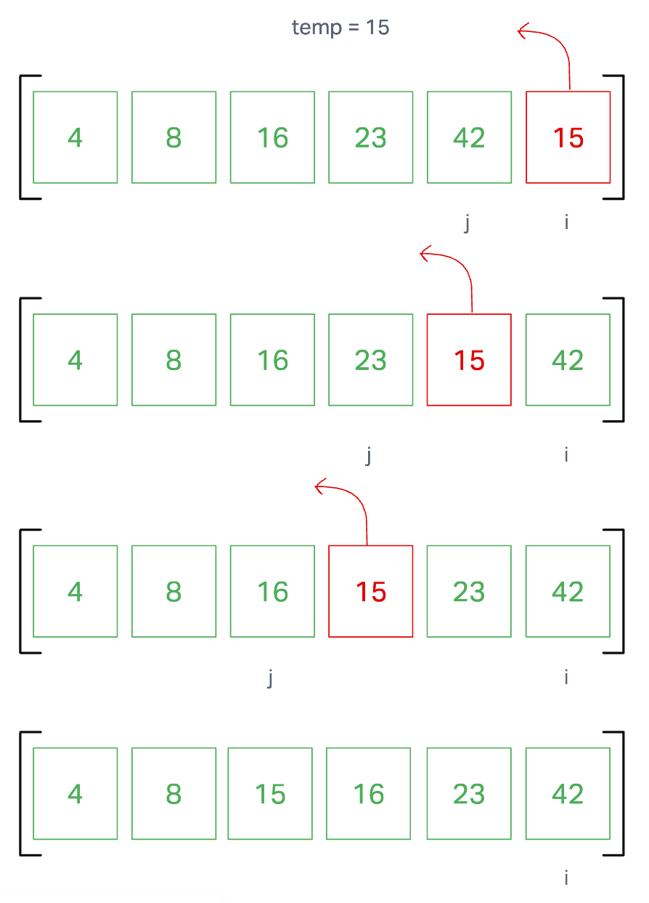

# Insertion Sort

Insertion Sort is a function that takes in an array and incrementally sorts it in ascending order.It compares each number to the number on it's left, if it is larger than that number then it is considered 'sorted', if it is smaller than that number then it swaps with it, then compares again to the number to the left until it is considered 'sorted'.

## Pseudocode

## Trace

Sample array: [8, 4, 23, 42, 16, 15]

### Pass One

Step one starts a for loop, then sets 'i' to 1 and 'j' to i-1, a temp variable is set to the value at index 'i'. While 'j' isn't 0 AND the value at index 'j' is larger than the temp value, swap the values at 'i' and 'j'. Decrease 'j' by one and evaluate if the while loop conditions remain true. Set the array at index j+1 to the temp value.

### Pass Two

The for loop increments and the steps repeat.

### Pass Three

The for loop increments and the steps repeat.

### Pass Four

The for loop increments and the steps repeat.

### Pass Five

The for loop increments and the steps repeat. When the for loop comes to an end, the array is sorted in ascending order.

### View the Code

[insertionSort](./index.js)

## Challenge Summary

Review the pseudocode below, then trace the algorithm by stepping through the process with the provided sample array. Document your explanation by creating a blog article that shows the step-by-step output after each iteration through some sort of visual.

Once you are done with your article, code a working, tested implementation of Insertion Sort based on the pseudocode provided.

## Approach & Efficiency

BigO: O(n)
