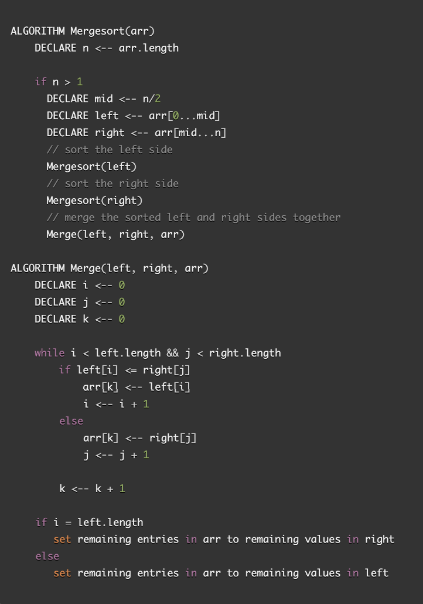
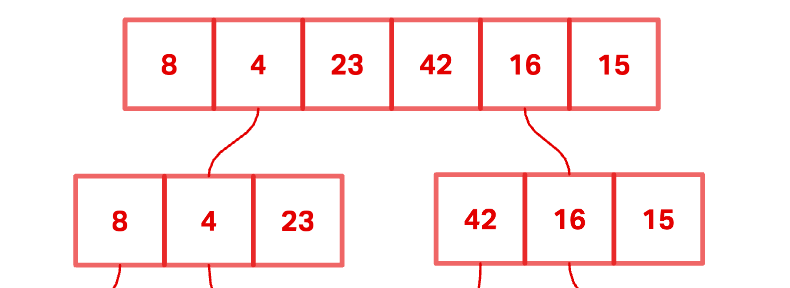
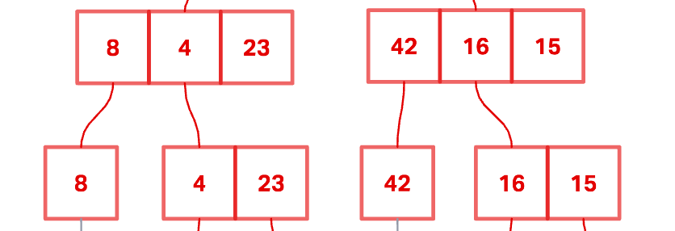
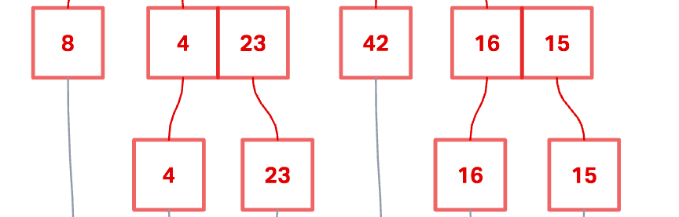
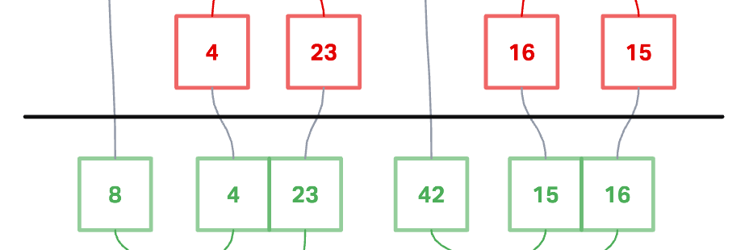
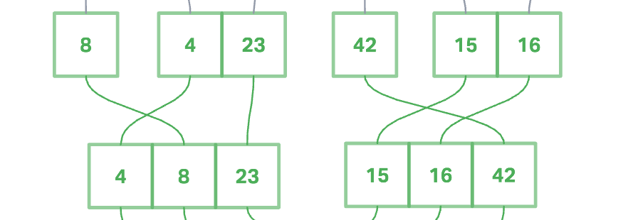
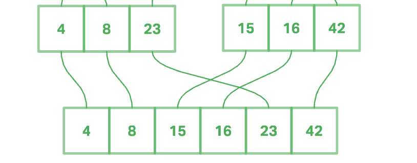

# Merge Sort

Merge Sort is a function that takes in an unordered array and incrementally sorts it in ascending order. It divides the array in half until you are left with several arrays of length 1. Then, it slowly merges those arrays back together by comparing the values of the siblings and placing those values into a temporary array in ascending order. This continues until all sub-arrays of the original array are compared and merged back together. Any remaining values from either the left or right will be tacked onto the end of the final array.

## Pseudocode

## Trace

Sample array: [8, 4, 23, 42, 16, 15]

### Pass One

Step one starts with an unordered array input into the mergeSort function. The midpoint of the array is found and the array is sliced in half at that midpoint, resulting in to sub-arrays.

### Pass Two

The slicing process continues..

### Pass Three

The slicing process continues and ends once you are left with several arrays of length 1.

### Pass Four

Then, the merge process begins. Pointers are declared to keep track of the index for both the left arrays and the right arrays, and a variable is also set to keep track of the final array's index. While values remain in both the left and right arrays, the values at the index of the pointers are compared, and the smaller value gets placed into the final array, followed by the next smaller, and so on.

### Pass Five

This process continues, comparing each left and right array pairs until the final merge between the last two arrays.

### Pass Six

The final merge results in the final array sorted in ascending order.

### View the Code

[mergeSort](./merge-sort.js)

## Challenge Summary

Review the pseudocode below, then trace the algorithm by stepping through the process with the provided sample array. Document your explanation by creating a blog article that shows the step-by-step output after each iteration through some sort of visual.

Once you are done with your article, code a working, tested implementation of Merge Sort based on the pseudocode provided.

## Approach & Efficiency

BigO: O(log(n))
