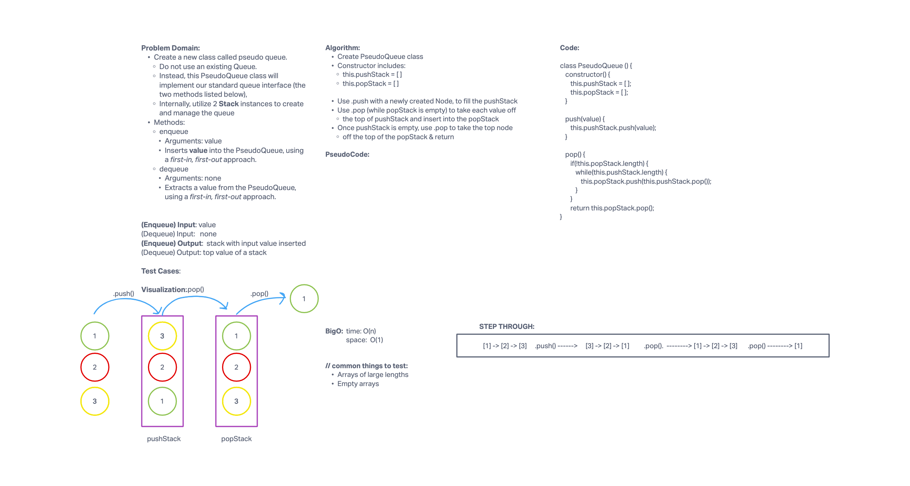

# Stack and Queue

A stack is a data structure that consists of Nodes. Each Node references the next Node in the stack, but does not reference its previous. In a stack, nodes can be visualized as stacked one on top of the other, where you can only add and remove one from the top.
A queue is a data structure that consists of Nodes. Each Node references the next Node in the queue, but does not reference its previous. In a queue, nodes can be visualized as standing in line, where you enter from one end and leave out the other.

## Challenge

- Node
  - Create a Node class that has properties for the value stored in the Node, and a pointer to the next node.
- Stack
  - Create a Stack class that has a top property. It creates an empty Stack when instantiated.
    - This object should be aware of a default empty value assigned to top when the stack is created.
    - The class should contain the following methods:
    - push
      - Arguments: value
      - adds a new node with that value to the top of the stack with an O(1) Time performance.
    - pop
      - Arguments: none
      - Returns: the value from node from the top of the stack
      - Removes the node from the top of the stack
      - Should raise exception when called on empty stack
    - peek
      - Arguments: none
      - Returns: Value of the node located at the top of the stack
      - Should raise exception when called on empty stack
    - is empty
      - Arguments: none
      - Returns: Boolean indicating whether or not the stack is empty.
- Queue
  - Create a Queue class that has a front property. It creates an empty Queue when instantiated.
    - This object should be aware of a default empty value assigned to front when the queue is created.
    - The class should contain the following methods:
    - enqueue
      - Arguments: value
      - adds a new node with that value to the back of the queue with an O(1) Time performance.
    - dequeue
      - Arguments: none
      - Returns: the value from node from the front of the queue
      - Removes the node from the front of the queue
      - Should raise exception when called on empty queue
    - peek
      - Arguments: none
      - Returns: Value of the node located at the front of the queue
      - Should raise exception when called on empty stack
    - is empty
      - Arguments: none
      - Returns: Boolean indicating whether or not the queue is empty
- Create a new class called pseudo queue.
  - Do not use an existing Queue.
  - Instead, this PseudoQueue class will implement our standard queue interface (the two methods listed below),
  - Internally, utilize 2 Stack instances to create and manage the queue
- Methods:
  - enqueue
    - Arguments: value
    - Inserts value into the PseudoQueue, using a first-in, first-out approach.
  - dequeue
    - Arguments: none
    - Extracts a value from the PseudoQueue, using a first-in, first-out approach.

## Approach & Efficiency

- .insert()
  - Approach: Create a new node with the value provided, if the head currently does not have a value - make the input value the head of the list. If a head already exists, set the 'next' of the new node to the existing 'head', then set the head to the new node.
  - BigO: O(1)
- .includes()
  - Approach:Set the current variable to the current head, while a current value exists, compare the input value to the current. If the values match, return true, else set the current to the 'next' of the current so that we traverse down the list. Keep comparing values and if there is no match, return false.
  - BigO: O(n)
- .toString()
  - Approach: Set a variable to an empty string, then while a current value exists, add the value of the current node to the string. Traverse down the list, adding the values to the string as you go. Once at the end of the list, return the string + 'NULL' (to depict that the last node 'next' points to null).
  - BigO: O(n)
- .append()
  - Approach: create a new node, if there is not a head then set the new node as the head. Set a current variable as the head and while there is a current.next, set current to the current.next (so that we traverse down the list until the end). Once at the end, set the current.next to the new node.
  - BigO: O(n)
- .insertBefore()
  - Approach: create a new node with the new value. Set a current variable to this.head and if the current.value equals the inpurt value, set the node.next to the current and the this.head to the node - return. Otherwise, while there is a current, as long as a current.next exits and the current.next.value equals the input value, set the node.next to the current.next and the current.next to the node - return. Else, set the current to the current.next and continue down the list.
  - BigO: O(n)
- .insertAfter()
  - Approach: create a new node with the new value. Set a current variable to this.head and while there is a current, if the current.value equals the input value, set the node.next to the current.next and the current.next to the node - return. Else, set the current to the current.next and continue down the list.
  - BigO: O(n)
- .kthFromEnd()
  - Approach: If there is no this.head, return 'empty list'. Otherwise, set a variable called length to 0 and set current to this.head. While there is a current, traverse down the linked list while incrementing the length so that you find the length of the linked list. If the length is less than OR equal to the value of k OR k is less than 0, return 'invalid request'. Set current again to this.head. Use a for loop to traverse down the linked list until you match the value of k, return current.value.
  - BigO(n^2)

## API

- Stack
  - .push()
    - Approach: create a new node with the input value, if there is no this.top then set this.top to the new node and return. Otherwise, set a variable current to this.top and while a current exists, set node.next to current. Then set this.top to node.
    - BigO: O(n)
  - .pop()
    - Approach: set a variable temp to this.top. If temp strictly equals null then return 'empty stack'. Else, set this.top to temp.next, set temp.next to null, then return temp.value.
    - BigO: O(1)
  - .peek()
    - Approach: if this.top strictly equals null, return 'empty stack', else return this.top.value.
    - BigO: O(1)
  - .isEmpty()
    - Approach: if this.top strictly equals null, return true, else return false.
    - BigO: O(1)
- Queue
  - .enqueue()
    - Approach: create a new node with the input value. If this.front does not exist, then set this.front to the new node and return. Otherwise, set a variable current to this.top. While a current.next exists, set current to node.next then set this.rear to current.next. Then set this.front to the node.
    - BigO: O(n)
  - .dequeue()
    - Approach: set a variable temp to this.front. If temp strictly equals null, then return 'empty queue'. Else, set this.front to tempt.next, set temp.next to null, and return temp.value.
    - BigO: O(1)
  - .peek()
    - Approach: if this.front strictly equals null, return 'empty queue'. Else, return this.front.value.
    - BigO: O(1)
  - .isEmpty()
    - Approach: if this.front strictly equals null, return true, else return false.
    - BigO: O(1)

## Whiteboard for PseudoQueue

