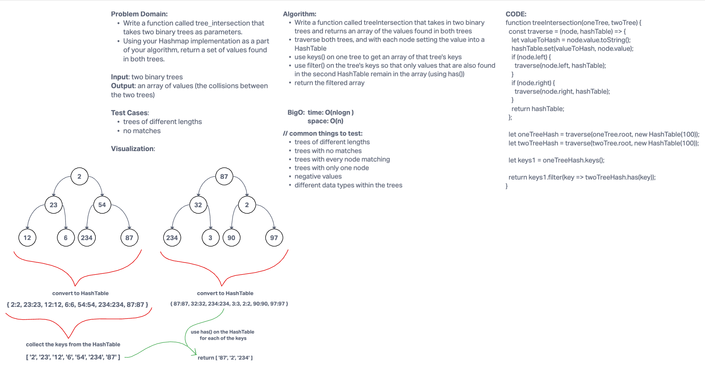

# Tree Intersection

- Authors: KC Hofstetter

## Whiteboard Process

## Approach & Efficiency

- Write a function called treeIntersection that takes in two binary trees and returns an array of the values found in both trees
- traverse both trees, and with each node setting the value into a HashTable
- use keys() on one tree to get an array of that tree's keys
- use filter() on the tree's keys so that only values that are also found in the second HashTable remain in the array (using has())
- return the filtered array

- Big O:
  - Time - O(nlogn)
  - Space - O(n)

## Solution

- You can find some test code at the bottom of the tree-intersection.js file! In your terminal, run 'npm test tree-intersection.js' to test this code.
