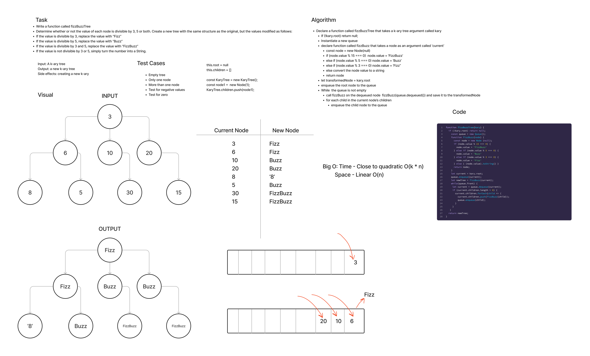

# FizzBuzz K-ary Tree

- Authors: Branden Ge & KC Hofstetter

## Whiteboard Process

## Approach & Efficiency (Our original algorithm)

- Declare a function called fizzBuzzTree that takes a k-ary tree argument called kary
  - If (!kary.root) return null;
  - Instantiate a new queue
  - declare function called fizzBuzz that takes a node as an argument called ‘current’
  - const node = new Node(null)
  - if (node.value % 15 === 0)  node.value = ‘FizzBuzz’
  - else if (node.value % 5 === 0) node.value = ‘Buzz’
  - else if (node.value % 3 === 0) node.value = ‘Fizz’’
  - else convert the node value to a string
  - return node
- let transformedNode = kary.root
- enqueue the root node to the queue
- While  the queue is not empty
  - call fizzBuzz on the dequeued node  fizzBuzz(queue.dequeued()) and save it to the transformedNode
  - for each child in the current node’s children
    - enqueue the child node to the queue

- Big O:
  - Time - Close to quadratic O(k * n)
  - Space - Linear O(n)

## Solution

- With the k-ary tree input into the function, you would enqueue the root and immediately dequeue it - then use the helper function to transform it to 'fizz' or 'buzz' or 'fizzubb' or the number as a string. When a node is dequeued, we would check to see if it had children and enqueue them as well. Then the cycle repeats itself dequeueing (while enqueueing the children) and performing the fizzbuzz helping function on the dequeued node values. As the values are transformed, they are used to create a new k-ary tree laid out how the original tree was laid out. That tree is returned.

- I should note that I messed with the code a little more after my collaboration with Branden, this is why the code I have submitted does not match the code in the whiteboard or the algorithm.
